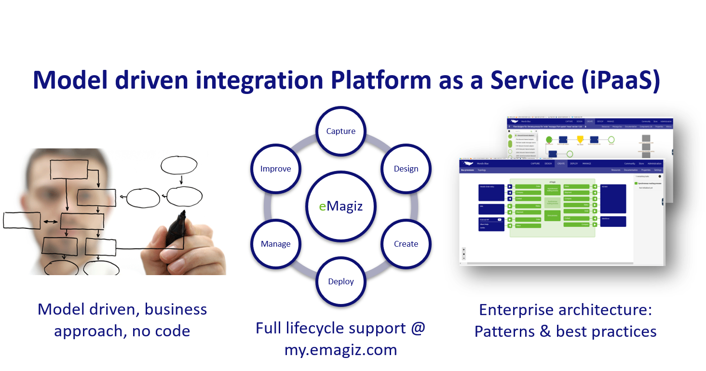

# eMagiz Platform documentation
---  
 
- [General iPaaS documentation  – How2 use iPaaS](iPaaS/overview.md)  
- [Integration scenarios and Messaging concepts](messaging/index.md)  
- [ILM Methodology – How2 apply methodology](ILM/overview.md)
- [Reference guide for components](/referenceguide/index.md) 
- [How2's](howto/index.md)
---

 

We position eMagiz as the model driven integration platform as a service, driving the bi-modal IT strategy of Gartner. 

Our positioning is based on 3 pillars:

**Pillar 1: architected models.  
Pillar 2: full lifecycle support.  
Pillar 3: built-in patterns and best practices.** 

**1. Pillar 1: architected models.** We empower citizen developers (working on mode 2 initiatives) with architected, model driven design tools that   
  * add abstraction and automation to delivery and support processes  
  * mitigate the risk of accidental architectures  
  * create a common language to collaborate with architects and IT pros  
  
**2. Pillar 2: full lifecycle support.** At my.emagiz.com we fully support the lifecycle of integrations, strongly focussing on jointly collecting and sharing the required information to rapidly connect mode 2 initiatives to the mode 1 ecosystem  

**3. Pillar 3: built-in patterns and best practices.** We visualize the evolvement of enterprise architectures with models throughout the several lifecycle phases and implemented an extensive set of enterprise integration patterns and best practices  

Combining architected models, full lifecycle support and built-in patterns and best practices, we drive the delivery of bi-modal IT. We help our customers increase their revenue and margins by reducing the time to market of mode 2 integrations and lowering the total costs of ownership to connect with the mode 1 ecosystem.  

Let’s sum up the key facts and figures about eMagiz and our value proposition:

  * 1 Multi-tenant iPaaS, fully supporting Integration Lifecycle Management with 100+ components
  * Managed Services: EDI, ESB & EAI for 80+ food & DIY retailers
  * We help our partners and customers drive bi-modal IT integration:
    * Reducing TTM of mode 1 application  integration, increasing revenue and margins of mode 2 initiatives
    * Lowering TCO of integration: smaller teams, faster implementation, reducing maintenance costs

<!--- 
- Tutorials
- Best practices 
--->
<!--- - Platform API documentation
- Release notes
--->

